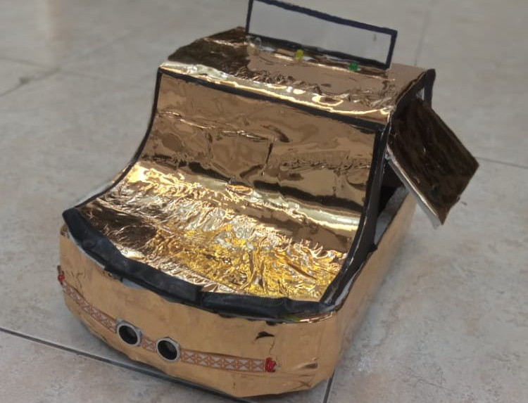

 
[](https://opensource.org/licenses/MIT) 
[](https://github.com/majdabualnour/next-generatin-car/actions) 
[](https://github.com/majdabualnour/next-generatin-car/issues) 
[](https://github.com/majdabualnour/next-generatin-car/network/members) 
[](https://github.com/majdabualnour/next-generatin-car/stargazers) 
[](https://github.com/majdabualnour/next-generatin-car/commits/main)

# 🚀 Next-Generation Car Automation Project



-----

## Welcome to the Future of Driving\!

Dive into the **Next-Generation Car Automation Project**, a fascinating collection of Python scripts and tools designed to explore the cutting edge of autonomous vehicle capabilities. While still a work in progress, this repository showcases foundational components for car perception, including advanced object detection, lane tracking, and even hardware interaction. It's a playground for anyone interested in bringing intelligent driving systems to life\!

-----

## 🌟 Features at a Glance

This project brings together several key modules, hinting at a comprehensive approach to car automation:

  * **🚦 Intelligent Object Detection:**
      * **Stop Sign Recognition:** Precisely identify stop signs to ensure safe and compliant driving.
      * **Traffic Light Analysis:** Detect and interpret traffic light signals, from red to green.
      * **General Object Identification:** Utilize powerful pre-trained models (like SSD MobileNet) to recognize a wide array of objects in the driving environment.
  * **🛣️ Advanced Lane Detection:** Accurately identify and track lane markings, crucial for maintaining vehicle position and navigation.
  * **📸 Dynamic Image Processing:** Essential utilities for cropping, manipulating, and enhancing images, preparing them for robust detection algorithms.
  * **⌨️ Real-time Input & Control:** Track keyboard inputs, allowing for manual control or simulation during development and testing.
  * **📡 Seamless Wireless Communication:** Potential for sending commands or data over Wi-Fi, opening doors for remote control or data streaming.
  * **🔗 Hardware Integration:** Includes sketches (likely for Arduino) for physical interactions, hinting at the project's capability to interface with real-world sensors and actuators.

-----

## 🛠️ Getting Started

Ready to explore the code? Here's how to set up the project on your local machine.

### Prerequisites

  * **Python 3.x:** Ensure you have a recent version of Python installed.
  * **Git:** For cloning the repository.

### Installation Steps

1.  **Clone the Repository:**
    Start by getting a copy of the project onto your computer:

    ```bash
    git clone https://github.com/majdabualnour/next-generatin-car.git
    cd next-generatin-car
    ```

2.  **Create a Virtual Environment (Highly Recommended\!):**
    Isolate your project dependencies to avoid conflicts with other Python projects:

    ```bash
    python -m venv venv
    source venv/bin/activate # On Windows, use `venv\Scripts\activate`
    ```

3.  **Install Dependencies:**
    This project heavily relies on powerful libraries for computer vision and machine learning. Since a `requirements.txt` file isn't provided, you'll need to install them manually. Based on the file names, these are likely candidates:

    ```bash
    pip install opencv-python numpy tensorflow pyserial pywhatkit # Add more as needed
    ```

    *Hint: If you encounter `ModuleNotFoundError` when running scripts, install the missing module using `pip install <module-name>`.*

-----

## 🚀 How to Use

The repository contains various scripts, each likely performing a distinct function. To get started, navigate through the files and run them individually.

  * **Exploring Object Detection:**
    Try running the core detection scripts. For example:
    ```bash
    python stop_sign_detection.py
    python trafificlightdetector.py
    ```
    These scripts might require input from your webcam, a video file, or an image.
  * **Lane Tracking:**
    ```bash
    python lanedetector.py
    ```
    This script will likely process video feeds to detect lanes.
  * **Interacting with Hardware:**
    The `theman.ino` file suggests Arduino integration. You'll need the Arduino IDE to upload this sketch to an Arduino board and then potentially run a Python script that communicates with it (e.g., via `pyserial`).

**Pro-Tip:** Open the `.py` files in your favorite code editor to understand their internal logic, required inputs, and expected outputs. The `appv*.py` files might represent different iterations of a main application.

-----

## 📂 Project Structure

Navigating the repository:

  * **`appv*.py`**: Likely different versions or stages of the main application.
  * **`coco.names`, `thenames`**: Text files containing labels for object detection models.
  * **`colorchecher.py`**: A utility for color identification or calibration.
  * **`frozen_inference_graph.pb`, `ssd_mobilenet_v3_large_coco_2020_01_14.pbtxt`**: Pre-trained deep learning models and their configuration for object detection.
  * **`imagecroper.py`, `imagedetecter.py`, `imageobjectdetection.py`**: Core scripts for image processing and object detection tasks.
  * **`keyboard_Input_tracker.py`, `keyboardtrackerv2.py`**: Modules for capturing and processing keyboard inputs.
  * **`lanedetector.py`**: The script dedicated to lane detection algorithms.
  * **`modules/`**: A directory potentially containing reusable code modules.
  * **`pywhatkit_dbs.txt`**: Suggests integration or usage of the `pywhatkit` library.
  * **`sendingusingthewifi.py`**: Script for network communication, likely via Wi-Fi.
  * **`stop_sign_detection.py`, `stopsigndetecter.py`**: Specific scripts for stop sign detection.
  * **`test.py`**: A general script for testing functionalities.
  * **`the_sign_detector_function.py`**: A modular function for sign detection.
  * **`theblinkcountet.py`**: Possibly related to blinking signals or indicator lights.
  * **`theman.ino`**: An Arduino sketch, indicating hardware interaction.
  * **`trafificlightdetector.py`**: Script for traffic light detection.
  * **`venv/`**: (After setup) Your Python virtual environment.

-----

## 🤝 Contributing

This project is a fantastic starting point for various car automation experiments\! While there are no explicit contribution guidelines yet, new ideas and improvements are always welcome.

To contribute:

1.  **Fork** this repository.
2.  **Create a new branch** for your feature or bug fix: `git checkout -b feature/your-awesome-feature`
3.  **Make your changes**, ensuring your code is clean and well-commented.
4.  **Commit** your changes with a clear message: `git commit -m 'Add: A brief description of your feature'`
5.  **Push** your branch to your forked repository: `git push origin feature/your-awesome-feature`
6.  **Open a Pull Request** against the `main` branch of this repository.

-----

## 📄 License

As of now, a specific license file (`LICENSE`) is not present in this repository. If you plan to use this code in a commercial or public project, it's recommended to reach out to the repository owner, Majd Abualnour, for clarification on licensing terms.

-----

## 🙏 Acknowledgments

A big shout-out to **TSC GROUP** for initiating this exciting "Next-Generation Car Automation" project. It provides a solid foundation for exploring the complexities and possibilities of autonomous driving systems\!

-----